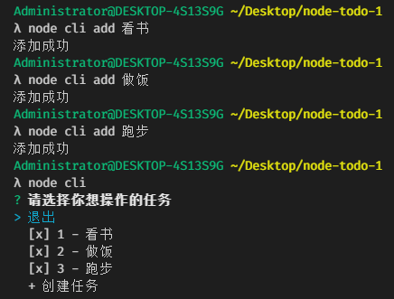
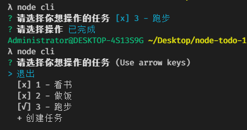
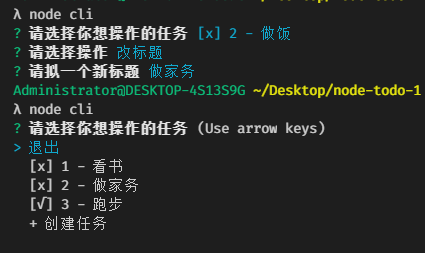
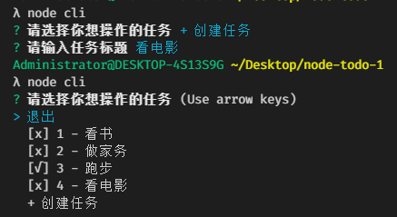
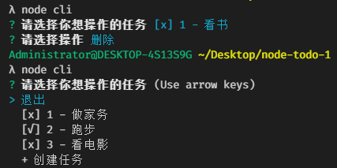

# node-todo：一个基于Node.js文件模块的小工具

***

## 功能

通过在终端输入的命令行来添加待做任务，并且实现**新增/编辑/删除/标记/展示**任务等功能，可以用于制定每日任务清单。

## 操作演示

- 通过命令行`node cli add 任务名`来创建任务，`node cli`展示当前所有任务，任务以按输入的顺序自动编号，编号前的[ × ]代表该任务未完成，[ √ ]表示该任务已完成：

- 设置将任务3由初始的“未完成”修改为“已完成”：

- 设置将任务2修改成新的任务标题：

- 不使用命令行`node cli add 任务名`，通过`+创建任务`来创建新的任务4：

- 删除选中的任务1：

## 发布到npm：（注意使用**npm源**而不是淘宝源）

https://www.npmjs.com/settings/xulei1998/packages
